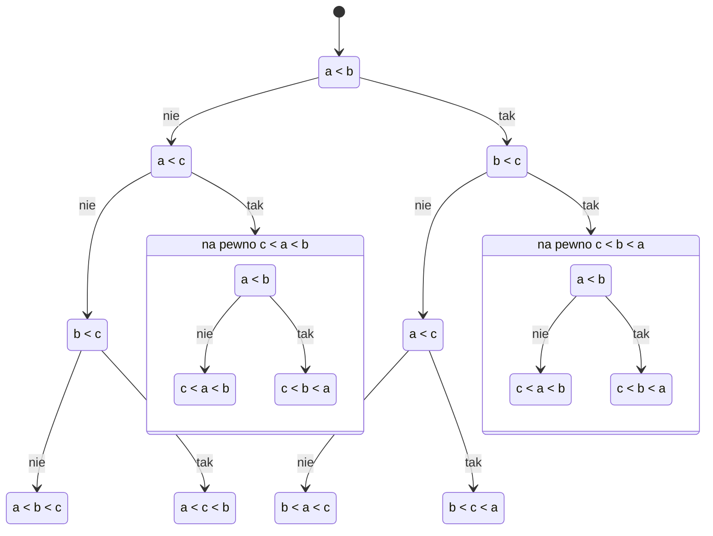

Jeżeli analizując algorytmy ograniczymy się do klasy programów mogących wykonywać jedynie porównania pomiędzy elementami, to naturalnie każde porównanie skieruje dalsze działanie algorytmu na dwa różne tory – algorytm można opisać drzewem binarnym.

Oczywiście dla różnych wielkości problemu potrzebowalibyśmy różnego rozmiaru drzew, dlatego dla pojedynczego problemu definiować będziemy rodzinę drzew $\{D_{i}\}_{i=1}^{\infty}$, gdzie $D_{i}$ rozwiązuje problem rozmiaru $i$.

## Przykład

### Sortowanie

Drzewo $D_{3}$ dla naiwnego rozwiązania problemu sortowania (select sort):

Jak łatwo zauważyć niektóre porównania są niepotrzebne. Moglibyśmy usunąć te porównania (zastąpić je liśćmi) i otrzymać drzewo odpowiadające innemu, lepszemu algorytmowi.

#### Szacowanie Dolnej Granicy Sortowania

**Twierdzenie:**
Jeżeli rodzina drzew decyzyjnych $\{D_{i}\}_{i=1}^{\infty}$ odpowiada algorytmowi sortowania, to każde drzewo $D_{n}$ jest wysokości co najmniej $\Omega (n \log n)$.
**d-d:**
Algorytm musi być w stanie posortować każdą permutację $\{1,\dots,n\}$ – musi istnieć liść odpowiadający każdej permutacji. Permutacji jest $n!$. Minimalne drzewo o $n!$ liściach ma wysokość $\Omega(\log n!) = \Omega(n \log n)$.
$$
\begin{align*}
n^{n} \ge n! \ge \left( \frac{n}{2} \right)^{n/2} \\
n \log n \ge \log n! \ge \frac{n}{2} \log \frac{n}{2} \\
\text{Z 3 ciągów: } \log n! \approx \Theta(n \log n)
\end{align*}
$$
> Ładniej ze wzoru Stirling'a wg. którego zachodzi: $n! \approx \sqrt{ 2\pi n }\left( \frac{n}{e} \right)^{n}$.

#### Ograniczenie Na Średnią Złożoność

Zauważmy, że przy analizie przeprowadzanej poprzez drzewa decyzyjne wartości elementów nie mają znaczenia. Stąd ograniczymy się do analizy działania dla zbioru $\{1,\dots,n\}$.

Zdefiniujmy więc:

- $P[\sigma]$ – prawdopodobieństwo wystąpienia permutacji $\sigma$ zbioru $S_{n}$ zawierającego wszystkie permutacje zbioru $\{1,\dots,n\}$
- $c(\sigma)$ – wysokość liścia do którego trzeba przejść sortując $\sigma$ co jest równoważne niezbędnej liczbie porównań do wykonania

Wtedy oczekiwana (średnia) złożoność algorytmu będzie dana równaniem:
$$
\sum\limits_{\sigma \in S_{n}} P[\sigma]\cdot c(\sigma)
$$

**Twierdzenie:**
Jeżeli każda permutacja jest jednakowo prawdopodobna, to wówczas każde drzewo decyzyjne sortujące $n$-elementowy ciąg liczb ma średnią głębokość co najmniej $\log(n!)$.
**d-d:**
Na głębokości $(n \log n) - 1$ znajduje się co najwyżej $\frac{n!}{2}$ liści (Bo ostatni jest dwa razy większy niż poprzedni...).
Stąd mamy co najmniej $\frac{n!}{2}$ liści na poziomach głębszych niż $n \log n$, co da nam średnią łącznie nie mniejszą niż $\frac{1}{2} n \log n$.
