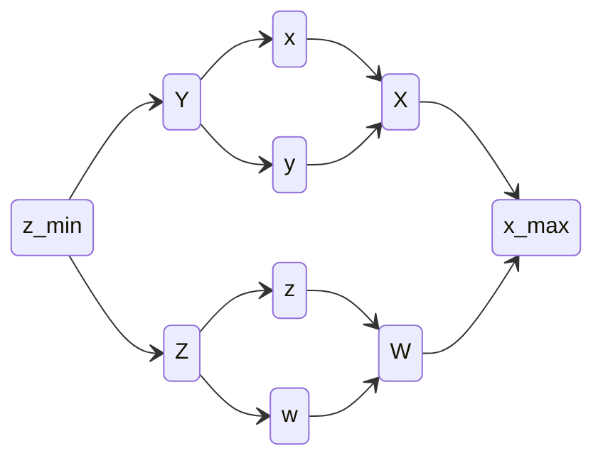

**Dane:**

- Zbiór $S = \{a_{1},a_{2},\dots,a_{n}\}$

**Zadanie:**

Wyznaczyć minimalne i maksymalne dane ze zbioru $S$.

## Naiwnie

Wykonujemy dwa przejścia po tablicy w których wyznaczamy osobno minimum i maksimum. Na to potrzeba $2n - 2$ porównań.
Pomimo asymptotycznie optymalnego czasu działania okazuje się, że można *lepiej*.

## Główna Obserwacja

Porównanie dwóch liczb wyznacza większą **i*** mniejszą.
Dla tablicy z czterema elementami wystarczy np.:

Gdzie porównania wykonujemy tylko dla par bezpośrednio pod sobą. Używamy wiec informacji z każdego dwukrotnie co pozwoli obniżyć liczbę porównań do $\left\lceil  \frac{2}{3}n - 2  \right\rceil$.
### Algorytm

Możemy rozpisać algorytm według strategii dziel i zwyciężaj, gdzie znajdywanie min/max na przedziale wykonujemy poprzez wyznaczenie tych wartości na pod-przedziałach, a następnie scalenie wyników (wzięcie min/max dwóch wartości).
```
def min_max(A[1..n]):
	if n == 1:
		return (A[0], A[0])
	if n == 2:
		# tu wykorzystujemy jedno porównanie do wyznaczenia min/max
		if A[0] < A[1]:
			return (A[0], A[1])
		else:
			return (A[1], A[0])
	
	# Dzielimy tak, by jak najwięcej razy wejść do przypadku dla dwóch zmienncyh
	div_point = 2^floor(log2(n))
	(lmin, lmax) = min_max(A[1..div_point])
	(rmin, rmax) = min_max(A[div_point+1..n])
	
	return (min(lmin, rmin), max(lmax, rmax))
```
