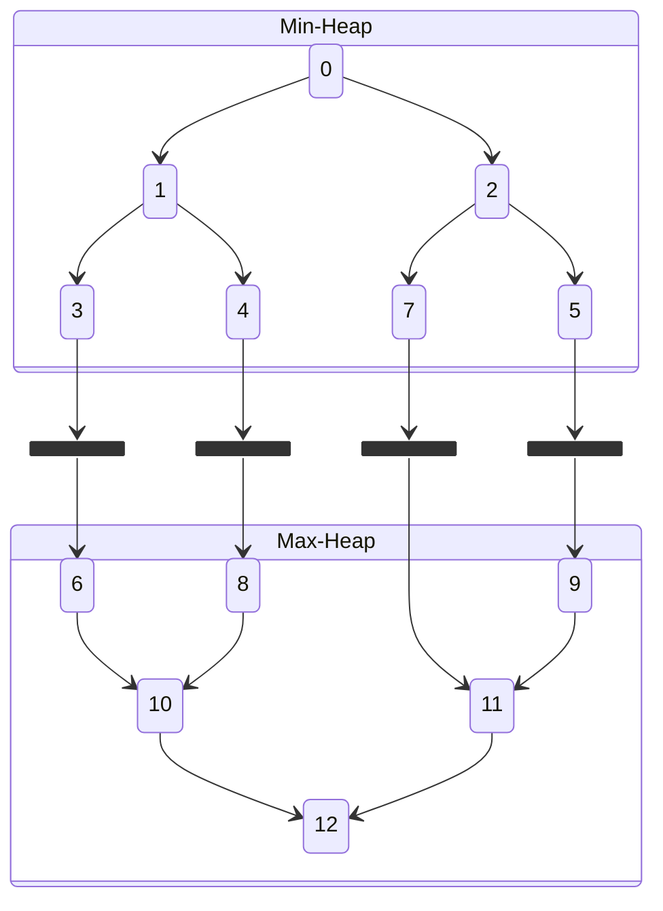

> Implementacja [[Kolejka Priorytetowa#Dwukierunkowa Kolejka Priorytetowa|dwukierunkowej kolejki priorytetowej]].

## Własności

Będziemy chcieli zbudować dwa *zwykłe* [[Kopiec (binarny)|kopce]] – jeden min drugi max i *połączyć* je ze sobą.
liście obu drzew:

> Mankament diagramu: $5\to 9$ powinno być na lewo od $7$. #TODO fix

Poza zachowaniem standardowych własności kopców będziemy chcieli, by:

- w kopcu $H$ było $\lceil n/2 \rceil$ elementów, a w $L$ $\lfloor n/2 \rfloor$.
- Każda ścieżka od korzenia $H$ do korzenia $L$ zawierała elementy w kolejności.

## Reprezentacja Tablicowa

Na to jest wiele pomysłów, można przechowywać drzewa zupełnie osobno lub spróbować przechować oba drzewa *obok siebie* (na różnych parzystościach).
Niezależnie od wybranej reprezentacji zawsze warto zbudować nad tym abstrakcje w stylu pary funkcji `get_min_heap` i `get_max_heap` zwracających wskaźniki na element tablicy.

## Operacje Na Kopcu

### Przesuwanie w Górę

Uznajemy oczywiście, że korzeń jest *na górze* dla obu drzew.
Dla kopców *osobno* operacje wyglądają tak jak [[Kopiec (binarny)#Przesuwanie w Górę|przesuwanie w górę]] dla jednego drzewa.

### Przesuwanie w Dół

Względem standardowego [[Kopiec (binarny)#Przesuwanie w Dół|przesuwania w dół]] wymagane jest dodatkowe rozpatrzenie przypadku, gdy przesuniemy element do liścia drzewa.

Zachowanie niezmiennika o kolejności elementów na ścieżce pomiędzy korzeniami może wymagać przesunięcia elementu do *drugiego drzewa* – jeżeli jest taka potrzeba to wykonujemy swap wartości liści w drzewie. Poprawność drzewa *wcześniej* gwarantuje nam, że *nie-przesuwany* element nie zepsuje własności.
*Przesuwany* element trzeba jednak *przesunąć w górę* drugiego drzewa, bo nie wiemy jak duży jest.

> To jest trochę nieprzyjemne w implementacji, ale nie jest trudne.

## Konstruowanie Kopca

Nie znam innego algorytmu niż wykonanie `insert` dla każdego elementu, który chcemy wstawić. To niestety zajmie czas $O(n\log(n))$.

## Operacje Kolejkowe

### Insert

1. Wybierz kopiec z niedoborem elementów
2. Wstaw nowy element jako liść
3. Sprawdź, czy należy wykonać zamianę z odpowiadającym liściem drugiego drzewa
	1. Wykonaj zamianę jeśli trzeba
4. Dla dodanego elementu wykonaj [[#Przesuwanie w Górę]] – nie ważne w którym kopcu

### Delete Min/Max

1. Wybierz ostatni element z kopca $H$ lub $L$ tak, by zachować własność liczności
2. Zamień min/max z wybranym elementem
3. Zmniejsz kopiec z którego element został wybrany
4. Wykonaj [[#Przesuwanie w Dół]] dla korzenia kopca min/max
