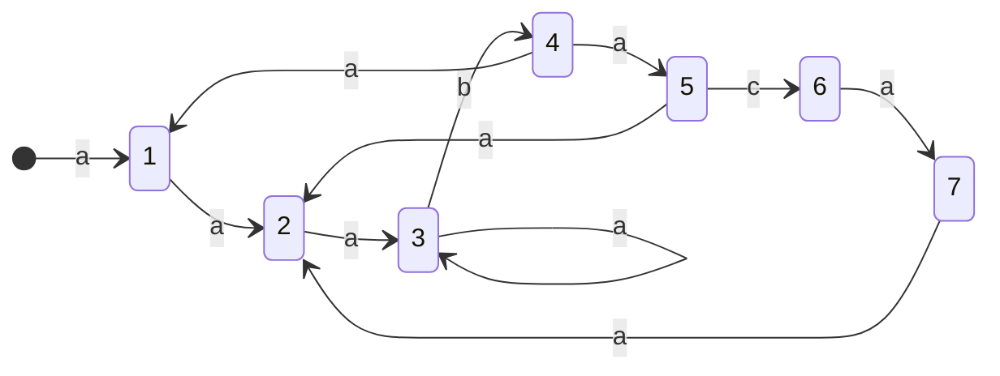

Stanom automatu będą odpowiadały wszystkie prefiksy wzorca (w tym pusty). Przejścia pomiędzy stanami będą wyznaczane następującą funkcją:
$$
\sigma(X) = \max\{k \mid P_{k} \text{ jest sufiksem } X\}
$$
Wtedy wyrażenie $\sigma(P_{i}x)$ będzie wyznaczało stan:

- $k = i+1$, jeżeli litera $x$ jest następnym znakiem wzorca
- $k \le i$, jeżeli nie możemy dopasować wzorca – spróbujemy z najdłuższym sufiksem

Dla słowa `aaabaca` będziemy mieć więc następujący [[Automat Moore'a]]:

> Jeżeli brakuje strzałki, to prowadzi ona do słowa pustego.
> Dotarcie do stanu `7` oznacza, że w tym miejscu tekstu kończy się wzorzec.

Przejścia pomiędzy stanami często oznacza się funkcją $\delta : Q \times \Sigma \to Q$ (stan, następny element $\to$ nowy stan).
Dla diagramu powyżej kilka wartości, które przyjmie funkcja stanu to np.:

- $\delta(4, a) = 5$
- $\delta(3, a) = 3$
- $\delta(6, b) = 0$

### Jak Uruchamiać?

Symulujemy działanie automatu dla danego tekstu.
Czas będzie liniowy względem napisu (jeżeli mamy gotowy automat).

### Jak Konstruować?

Naiwnie możemy konstruować automat w czasie $O(m|\Sigma|^{3})$:

- Dla każdego elementu wzorca – $m$ razy
	- Dla każdej litery w alfabecie – $|\Sigma|$ razy
		- Dla każdej długości potencjalnego sufiksu – $O(m)$ razy
			- Jeżeli jest sufiksem to dodaj przejście i idź do następnej litery – $O(m)$

#### Lepiej z Funkcją Prefiksową

- Wyznacz tablicę $\pi$ – $O(m)$
- Dla każdego elementu wzorca (o indeksie $q$) – $m$ razy
	- Dla każdej litery $l$ w alfabecie – $|\Sigma|$ razy
		- Jeżeli $l$ przedłuża wzorzec, to ustaw $\delta(q, l) = q+1$
		- W przeciwnym razie $\delta(q, l) = \delta(\pi[q-1], l)$

> Dowód poprawności pewnie jakiś indukcyjny po $q$. 